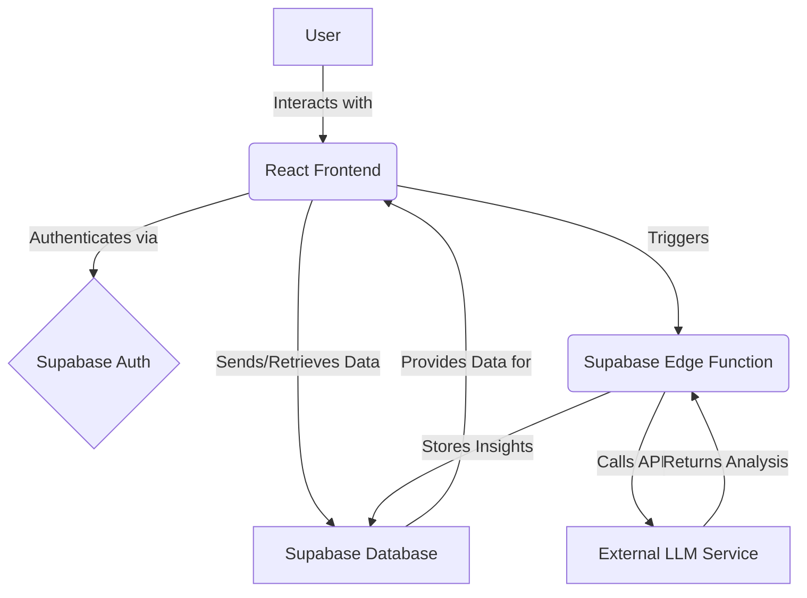

# Technical Requirements Document (TRD): The Mindful Log (Comprehensive)

**Author:** Manus AI
**Version:** 1.0
**Date:** April 29, 2026

## 1. Introduction

This Technical Requirements Document (TRD) outlines the technical specifications for **The Mindful Log**, an AI-powered psychology journal. It details the system architecture, database design, API specifications, and the intricate logic of the AI-driven 
features, providing a blueprint for development, particularly for implementation using tools like Claude Code.

## 2. System Architecture

The Mindful Log will employ a modern, scalable, and secure architecture, leveraging a serverless backend and a responsive frontend. The core components include:

*   **Frontend (Client-Side):** A web-based application built with React, providing the user interface for journaling, viewing insights, and interacting with the grounding aid.
*   **Backend-as-a-Service (BaaS):** Supabase, which provides a PostgreSQL database, authentication services, and serverless Edge Functions for secure API endpoints and AI integration.
*   **AI Services:** External Large Language Models (LLMs) accessed via API for Natural Language Processing (NLP) tasks, including sentiment analysis, cognitive distortion detection, and reflective prompt generation.



## 3. Database Schema (Supabase PostgreSQL)

The database schema is designed to securely store user data, journal entries, and AI-generated insights, ensuring data integrity and efficient retrieval. Row-Level Security (RLS) will be enabled on all tables to enforce data isolation per user.

### 3.1. `profiles` Table

Stores user metadata and links to Supabase Authentication.

| Column Name | Data Type | Constraints | Description |
| :---------- | :-------- | :---------- | :---------- |
| `id`        | `UUID`    | `PRIMARY KEY`, `REFERENCES auth.users` | Unique identifier for the user, linked to Supabase Auth. |
| `username`  | `TEXT`    | `UNIQUE`, `NOT NULL` | User's chosen display name. |
| `avatar_url`| `TEXT`    | `NULLABLE`  | URL to user's profile picture. |
| `created_at`| `TIMESTAMP WITH TIME ZONE` | `DEFAULT now()` | Timestamp of profile creation. |
| `updated_at`| `TIMESTAMP WITH TIME ZONE` | `DEFAULT now()` | Last update timestamp. |

### 3.2. `journals` Table

Organizes user entries into distinct journals.

| Column Name | Data Type | Constraints | Description |
| :---------- | :-------- | :---------- | :---------- |
| `id`        | `UUID`    | `PRIMARY KEY`, `DEFAULT gen_random_uuid()` | Unique identifier for the journal. |
| `owner_id`  | `UUID`    | `NOT NULL`, `REFERENCES profiles(id)` | Foreign key linking to the `profiles` table. |
| `title`     | `TEXT`    | `NOT NULL`  | User-defined title for the journal (e.g., "Gratitude 2026"). |
| `created_at`| `TIMESTAMP WITH TIME ZONE` | `DEFAULT now()` | Timestamp of journal creation. |
| `updated_at`| `TIMESTAMP WITH TIME ZONE` | `DEFAULT now()` | Last update timestamp. |

### 3.3. `entries` Table

Stores the core journal content and initial AI analysis.

| Column Name | Data Type | Constraints | Description |
| :---------- | :-------- | :---------- | :---------- |
| `id`        | `UUID`    | `PRIMARY KEY`, `DEFAULT gen_random_uuid()` | Unique identifier for the entry. |
| `journal_id`| `UUID`    | `NOT NULL`, `REFERENCES journals(id)` | Foreign key linking to the `journals` table. |
| `content`   | `TEXT`    | `NOT NULL`  | The raw, unedited journal entry text. |
| `sentiment` | `TEXT`    | `NOT NULL`, `CHECK (sentiment IN ('Positive', 'Balanced', 'High-Distress'))` | AI-classified emotional tone. |
| `distortions`| `JSONB`   | `NOT NULL`, `DEFAULT '[]'` | JSON array of detected cognitive distortions. |
| `created_at`| `TIMESTAMP WITH TIME ZONE` | `DEFAULT now()` | Timestamp of entry creation. |
| `updated_at`| `TIMESTAMP WITH TIME ZONE` | `DEFAULT now()` | Last update timestamp. |

### 3.4. `insights` Table

Stores AI-generated reflective prompts and detected patterns, linked to specific entries.

| Column Name | Data Type | Constraints | Description |
| :---------- | :-------- | :---------- | :---------- |
| `id`        | `UUID`    | `PRIMARY KEY`, `DEFAULT gen_random_uuid()` | Unique identifier for the insight. |
| `entry_id`  | `UUID`    | `NOT NULL`, `UNIQUE`, `REFERENCES entries(id)` | Foreign key linking to the `entries` table. One insight per entry. |
| `mirror_prompt`| `TEXT`    | `NOT NULL`  | The AI-generated reflective question. |
| `pattern_detected`| `TEXT`    | `NULLABLE`  | Summary of recurring themes or patterns (future enhancement). |
| `created_at`| `TIMESTAMP WITH TIME ZONE` | `DEFAULT now()` | Timestamp of insight generation. |

## 4. API Endpoints (Supabase Edge Functions)

Supabase Edge Functions will be used to encapsulate the AI interaction logic, ensuring API keys are kept secure and enabling complex agentic workflows. These functions will be written in TypeScript.

### 4.1. `analyze-entry` Function

*   **Endpoint:** `/functions/v1/analyze-entry`
*   **Method:** `POST`
*   **Request Body:**
    ```json
    {
      "entry_id": "uuid-of-entry",
      "content": "The user's journal entry text"
    }
    ```
*   **Functionality:**
    1.  Receives `entry_id` and `content` from the frontend.
    2.  Calls the external LLM API for sentiment analysis and cognitive distortion detection.
    3.  Based on the analysis, generates a `mirror_prompt`.
    4.  Updates the `entries` table with `sentiment` and `distortions`.
    5.  Inserts a new record into the `insights` table with the `mirror_prompt`.
    6.  Returns the analysis results to the frontend.
*   **Response Body (Success):**
    ```json
    {
      "sentiment": "High-Distress",
      "distortions": ["Catastrophizing", "Should Statement"],
      "mirror_prompt": "What would it mean to accept that some things are beyond your control?"
    }
    ```
*   **Error Handling:** Returns appropriate HTTP status codes (e.g., 400 for bad request, 500 for internal server error) with descriptive error messages.

## 5. Agentic Workflow: The "Reflective Mirror" Implementation

This section details the step-by-step technical implementation of the AI-driven reflective process.

### 5.1. Triggering Analysis

*   **Event:** User saves a new or updated journal entry.
*   **Frontend Action:** The React frontend makes a `POST` request to the `/functions/v1/analyze-entry` Edge Function, passing the `entry_id` and `content`.

### 5.2. LLM Interaction Logic (within `analyze-entry` Edge Function)

1.  **Input Preparation:** The `content` is formatted into a prompt suitable for the chosen LLM (e.g., OpenAI GPT-4.1-mini/nano or Claude Code).
    *   **Prompt for Sentiment & Distortion:**
        ```
        '''
        Analyze the following journal entry for overall sentiment (Positive, Balanced, High-Distress) and identify any of these cognitive distortions: 
        "Should" Statements, Catastrophizing, All-or-Nothing Thinking. Provide the output as a JSON object with `sentiment` (string) and `distortions` (array of strings).

        Journal Entry: """<content>"""
        JSON Output:
        ```
        
        ```
        
    *   **Prompt for Reflective Mirror:**
        ```
        You are an empathetic AI assistant designed to help users reflect on their journal entries. Your goal is to provide a non-judgmental, thought-provoking question that encourages deeper self-awareness, especially around cognitive distortions. Do not offer advice or diagnoses. Focus on open-ended questions.

        User's Journal Entry: """<original_content>"""
        Detected Sentiment: <sentiment>
        Detected Distortions: <distortions_list>

        Based on this, generate one reflective question for the user. Example: "You mentioned 'I should have.' What would happen if you gave yourself permission not to?"
        Reflective Question:
        ```
2.  **LLM Call:** Make an API call to the chosen LLM with the prepared prompt.
3.  **Response Parsing:** Parse the LLM's JSON response to extract `sentiment`, `distortions`, and `mirror_prompt`.
4.  **Database Update:**
    *   Update the `entries` table for the given `entry_id` with the `sentiment` and `distortions`.
    *   Insert a new record into the `insights` table with the `entry_id` and `mirror_prompt`.
5.  **Return Results:** Send the `sentiment`, `distortions`, and `mirror_prompt` back to the frontend.

### 5.3. Grounding Aid Logic

*   **Trigger:** When the `analyze-entry` Edge Function returns a `sentiment` of `High-Distress`.
*   **Frontend Action:** The frontend will dynamically display a prominent 
"Ground Me Now" button or a similar visual cue. Clicking this button will initiate the 5-4-3-2-1 sensory grounding exercise, guiding the user through prompts.

## 6. Security and Privacy

Given the sensitive nature of personal journal entries, robust security and privacy measures are paramount.

*   **Authentication & Authorization:** Supabase Auth will handle user registration, login, and session management. Row-Level Security (RLS) policies will be strictly enforced on all database tables to ensure that users can only access and modify their own data.
*   **Data Encryption:** All data in transit between the client and Supabase will be encrypted using SSL/TLS. Data at rest within the Supabase PostgreSQL database will also be encrypted.
*   **API Key Management:** All API keys for external LLM services will be stored securely as environment variables within Supabase Edge Functions and never exposed on the client-side.
*   **Data Minimization:** Only necessary data will be collected and processed. Journal entry content sent to LLMs for analysis will be stripped of any obvious Personally Identifiable Information (PII) where feasible, or users will be advised on best practices for anonymization.
*   **Consent & Transparency:** Users will be informed about how their data is used, processed by AI, and stored, with clear consent mechanisms.

## 7. Testing Strategy

A multi-faceted testing approach will be employed to ensure the reliability, accuracy, and security of The Mindful Log.

*   **Unit Tests:** For individual frontend components (React) and backend functions (Supabase Edge Functions).
*   **Integration Tests:** To verify the seamless interaction between the frontend, Supabase API, and external LLM services.
*   **End-to-End (E2E) Tests:** Simulating user journeys to ensure core features (journaling, AI analysis, grounding aid, journey map) function as expected.
*   **Security Audits:** Regular reviews of RLS policies, authentication flows, and API key management.
*   **AI Model Evaluation:** Continuous monitoring of LLM performance for sentiment detection and distortion flagging, with a focus on accuracy, bias detection, and ethical alignment.

## 8. Future Enhancements (Post-MVP Technical Considerations)

*   **Real-time AI Feedback:** Explore WebSocket integration for instant AI analysis as the user types.
*   **Customizable Distortion Detection:** Allow users to define and train the AI to recognize their unique cognitive patterns.
*   **Advanced Analytics:** Integrate with a dedicated analytics platform for deeper insights into user engagement and well-being trends.
*   **Offline Mode:** Implement local storage solutions for journaling when offline, syncing with Supabase when connectivity is restored.

## 9. References

[1] Doodles NFT. (n.d.). *Doodles.app*. Retrieved from [https://www.doodles.app/](https://www.doodles.app/)
[2] Martin, S. (n.d.). *Burnt Toast Creative*. Retrieved from [https://burnttoast.myportfolio.com/](https://burnttoast.myportfolio.com/)
[3] American Psychological Association. (n.d.). *Cognitive Behavioral Therapy*. Retrieved from [https://www.apa.org/ptsd-guideline/patients-and-families/cognitive-behavioral](https://www.apa.org/ptsd-guideline/patients-and-families/cognitive-behavioral)
[4] Supabase. (n.d.). *The Open Source Firebase Alternative*. Retrieved from [https://supabase.com/](https://supabase.com/)
[5] React. (n.d.). *React – A JavaScript library for building user interfaces*. Retrieved from [https://react.dev/](https://react.dev/)
[6] Tailwind CSS. (n.d.). *Rapidly build modern websites without ever leaving your HTML*. Retrieved from [https://tailwindcss.com/](https://tailwindcss.com/)
[7] OpenAI. (n.d.). *OpenAI API*. Retrieved from [https://openai.com/docs/api](https://openai.com/docs/api)
[8] Anthropic. (n.d.). *Claude API*. Retrieved from [https://www.anthropic.com/api](https://www.anthropic.com/api)
